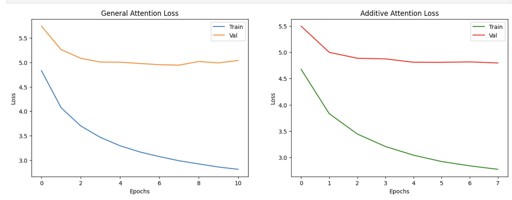
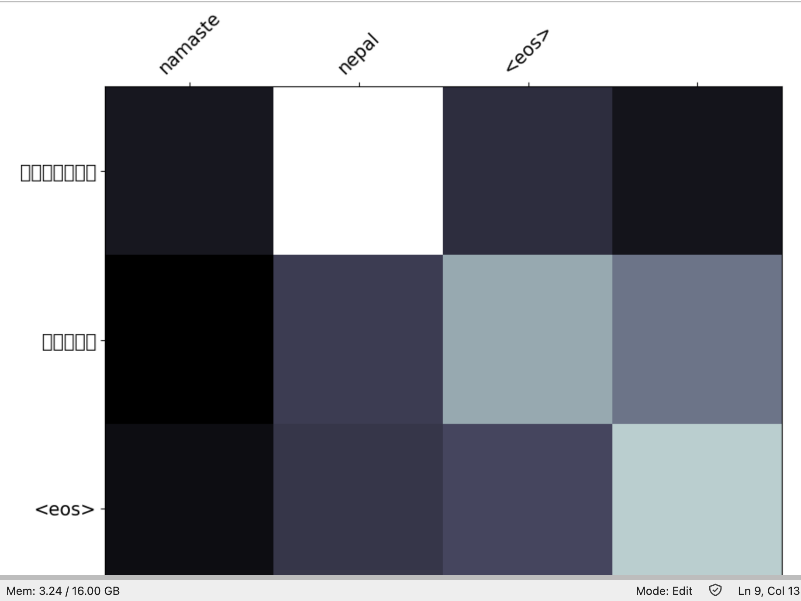
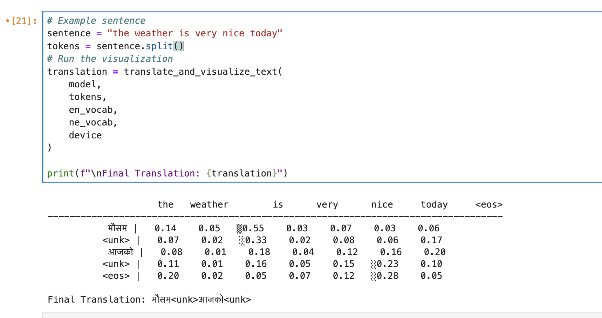

# A3 : Machine Translation

For this assignment, we are supposed to train two models, using dataset from our Native Language to English. My Native language is Nepali. The details of the project are described below:

## Setup Instructions
0. cd `A3-Machine_Translation`
1. Install dependencies: `pip install -r requirements.txt`
2. The files are large so please use [this](https://drive.google.com/drive/folders/1aSoUWQzLXaOiwSzPuFzOdgx-O46pXsY0?usp=sharing) link to download.Ensure all `.pt` and `.pkl` files are in the same directory as `app.py`. 
3. Run the app: `streamlit run app.py`

## Dataset and Tokenizer library
I used [this github repository](https://github.com/sharad461/nepali-translator?tab=readme-ov-file) to source translation pair data. [This drive link](https://drive.google.com/file/d/1UThfJKJFvDgTu263DNbz-WPNLqoARZ_0/view) contains the relevant file that has been used. Please refer train.en and train.ne . These two files must be in the working directory to run the notebook. Thankyou to [Sharad Duwal](https://github.com/sharad461) for providing the dataset. 

To tokenize the dataset, [IndicNLP](https://indicnlp.ai4bharat.org/pages/home/) was used. The python package can be found in this [link](https://pypi.org/project/indic-nlp-library/). 

## Dataset Processing and Handling

The following experimentation were done while processing the dataset and the learnings have been shared below:

1. I experimented with a few tokenizer libraries. [universalml/Nepali_Tokenizer](https://huggingface.co/universalml/Nepali_Tokenizer) was one of the tokenizer I used. But I noticed that this tokenizer had some issues. Upon investigation, I realized <code>IndicNLP</code>, mentioned above was quite better. 
2. IndicNLP is actually a python library that supports Indian languages. Since Nepali language share the same etymology as Indian language i.e Devanagari script, I planned to use this library. Turns out it works perfectly. A Nepali language tokenizer would ideally be better, but for experimentation purposes, this library works too. 
3. While creating a <code>DataLoader</code>, an issue was found. The dataset contains very long sequence of text in a single line. This caused model training in Puffer to raise <code>OutOfMemory</code> error a lot. Thus, the  <code>tensor_transform</code> function has been changed to accomodate this issue. The solution was simple, to limit single sentence to 'x' tokens. In my case I set the <code>MAX_LEN = 100 </code>.
4. Additionally, to ensure no <code>OutOfMemory</code> error, the <code>collate_batch</code> function now supports explicit type conversion to <code>.long()</code> (alias to <code>torch.int64</code>). This ensures that even if <code>autocast</code> is running, the specific tensors stay as integers. The autocast was used because training was done in Puffer (Nvidia RTX 2080 Ti). With less, VRAM this had to be done. 
5. A high <code>min_freq=20</code> was used for Nepali tokens. A higher value reduces model's memory usage and prevents it from trying to learn rare words or 'noise' that appear too infrequently to be useful. Refer the table below:

**Total Tokens for Nepali dataset:** 1,679,279  
**Total Unique Words (Raw) for Nepali dataset:** 137,851  

---
| Minimum Frequency (`min_freq`) | Vocabulary Size | Unique Words to `<unk>` | Dataset Coverage |
| :--- | :--- | :--- | :--- |
| **2** | 57,749 | 80,106 | 95.23% |
| **5** | 24,186 | 113,669 | 90.09% |
| **10** | 13,765 | 124,090 | 86.05% |
---

## Experimentation with Attention Mechanism

Implementation of the Seq2Seq architecture with both General (Luong) and Additive (Bahdanau) attention mechanism has been done. Some details are:
1. <b>Defined the Encoder:</b> Implemented a bidirectional GRU with packed sequences to handle variable lengths.

2. <b>Defined the Decoder:</b> Integrated the attention context vector into the GRU input and the final linear layer.

3. <b>Implemented Dual Attention:</b> Created a flexible Attention class that supports both dot-product based "General" attention and MLP-based "Additive" attention.

The following table summarizes the details:

| Attention Type | Mathematical Formula | Key Characteristics |
| :--- | :--- | :--- |
| **General Attention** | $e_i = s^T h_i$ | Simple dot product alignment; requires $d_1 = d_2$. |
| **Additive Attention** | $e_i = v^T \tanh(W_1 h_i + W_2 s)$ | Uses a feed-forward layer to learn alignment; more flexible for different dimensions. |

## Result

<b>Training Comparison: General vs. Additive Attention</b>

This report summarizes the training performance and validation metrics for two different attention mechanisms: **General Attention** (Luong-style) and **Additive Attention** (Bahdanau-style).

---

## 1. General Attention (Luong)
* **Total Training Time:** ~94 minutes
* **Status:** Early stopping triggered at Epoch 11.
* **Best Model:** Epoch 08 (Val Loss: 4.945)

| Epoch | Time | Train Loss | Train PPL | Val. Loss | Val. PPL | Status |
| :--- | :--- | :--- | :--- | :--- | :--- | :--- |
| 01 | 8m 43s | 4.834 | 125.695 | 5.744 | 312.445 | 🏆 Checkpoint |
| 02 | 8m 33s | 4.073 | 58.749 | 5.263 | 193.099 | 🏆 Checkpoint |
| 03 | 8m 33s | 3.699 | 40.406 | 5.085 | 161.539 | 🏆 Checkpoint |
| 04 | 8m 33s | 3.463 | 31.907 | 5.008 | 149.566 | 🏆 Checkpoint |
| 05 | 8m 34s | 3.292 | 26.894 | 5.005 | 149.229 | 🏆 Checkpoint |
| 06 | 8m 34s | 3.166 | 23.711 | 4.979 | 145.317 | 🏆 Checkpoint |
| 07 | 8m 36s | 3.070 | 21.539 | 4.954 | 141.671 | 🏆 Checkpoint |
| 08 | 8m 35s | 2.985 | 19.794 | **4.945** | **140.514** | 🏆 **Best** |
| 09 | 8m 37s | 2.920 | 18.540 | 5.019 | 151.273 | Overfitting |
| 10 | 8m 35s | 2.857 | 17.407 | 4.991 | 147.096 | - |
| 11 | 8m 34s | 2.810 | 16.607 | 5.040 | 154.411 | Early Stop |

---

## 2. Additive Attention (Bahdanau)
* **Total Training Time (to Epoch 8):** ~78 minutes
* **Observation:** Takes longer per epoch (~9m 47s vs ~8m 35s) but achieves a lower validation loss significantly faster.

| Epoch | Time | Train Loss | Train PPL | Val. Loss | Val. PPL | Status |
| :--- | :--- | :--- | :--- | :--- | :--- | :--- |
| 01 | 9m 49s | 4.676 | 107.392 | 5.497 | 243.907 | 🏆 Checkpoint |
| 02 | 9m 47s | 3.832 | 46.156 | 4.999 | 148.241 | 🏆 Checkpoint |
| 03 | 9m 46s | 3.445 | 31.351 | 4.886 | 132.387 | 🏆 Checkpoint |
| 04 | 9m 47s | 3.207 | 24.712 | 4.874 | 130.819 | 🏆 Checkpoint |
| 05 | 9m 47s | 3.042 | 20.955 | 4.810 | 122.729 | 🏆 Checkpoint |
| 06 | 9m 47s | 2.921 | 18.558 | 4.809 | 122.619 | 🏆 Checkpoint |
| 07 | 9m 46s | 2.839 | 17.100 | 4.817 | 123.602 | - |
| 08 | 9m 47s | 2.773 | 16.008 | **4.796** | **120.988** | 🏆 **Best** |

---

Summary
* **Performance:** Additive Attention is outperforming General Attention. By epoch 8, Additive reached a Val PPL of **120.9**, whereas General was still at **140.5**.
* **Efficiency:** General Attention is faster per epoch (approx. **13% faster**), but requires more epochs to converge and seems more prone to early overfitting.

## Loss Graphs

### Performance Comparison: General vs. Additive Attention

| Metric | General Attention (Luong) | Additive Attention (Bahdanau) |
| :--- | :--- | :--- |
| **Translation Accuracy** | Lower (Best Val PPL: **140.5**) | **Higher** (Best Val PPL: **120.9**) |
| **Comp. Efficiency** | **Faster** (~8m 35s per epoch) | **Slower** (~9m 47s per epoch) |
| **Convergence** | Prone to overfitting; triggered early stop. | More stable; generalized better. |
| **Mathematical Basis** | Dot-product/Bilinear ($s_t^T W_a h_i$) | Feed-forward layer ($v_a^T \tanh(W_a [s_t; h_i])$) |

## **Key Findings**
1. **Accuracy:** Additive attention significantly outperformed General attention, achieving a much lower perplexity. This suggests the non-linear transformation in the alignment score helps the model capture better context.
2. **Speed:** General attention is approximately **12-15% faster** per training epoch. This is expected as dot-product operations are more computationally efficient than the feed-forward network used in Additive attention.
3. **Training Behavior:** General attention reached its peak performance early (Epoch 8) before validation loss began to climb, whereas Additive attention showed a more consistent downward trend in loss.

| Model Type | Best Training Loss | Best Training PPL | Best Validation Loss | Best Validation PPL |
| :--- | :--- | :--- | :--- | :--- |
| **General Attention** | 2.985 | 19.794 | 4.945 | 140.514 |
| **Additive Attention** | 2.773 | 16.008 | **4.796** | **120.988** |

## Attention Map 

Matplotlib has some issue displaying devnagari fonts. It was difficult getting this to work in Puffer server. But, I have shown the equivalent using the image below:

## Web App

