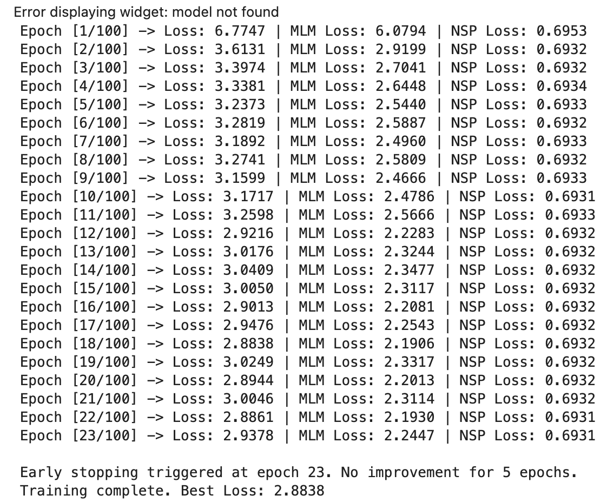
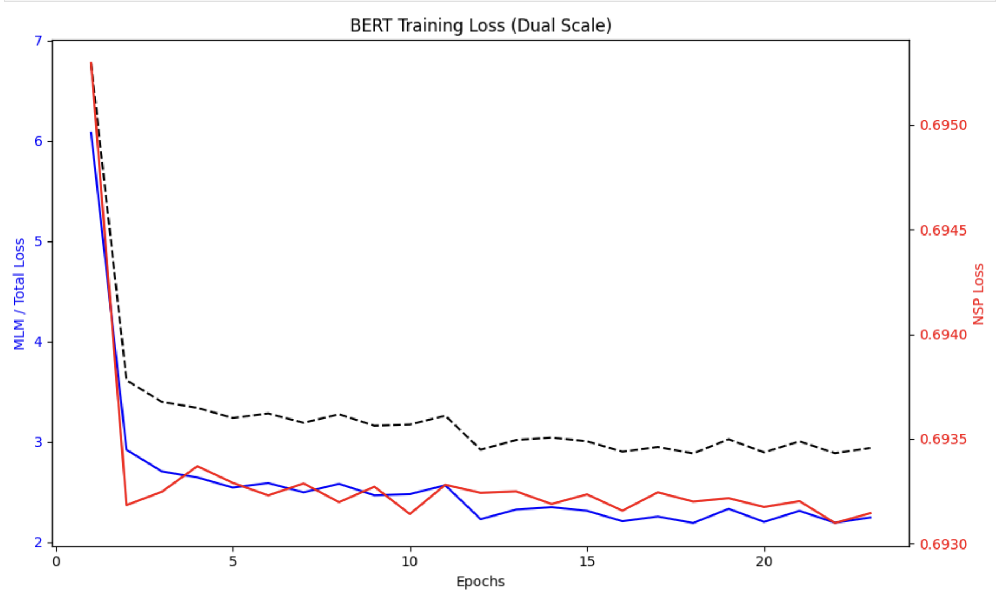
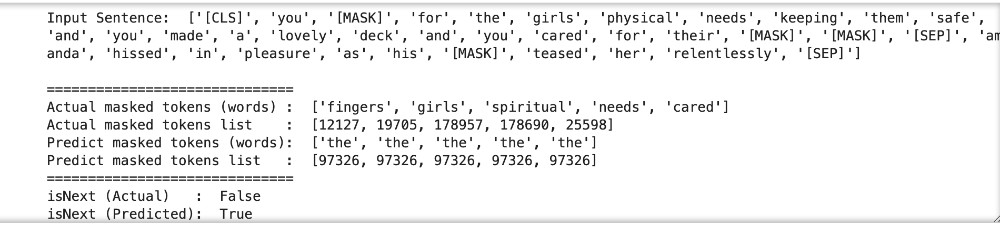
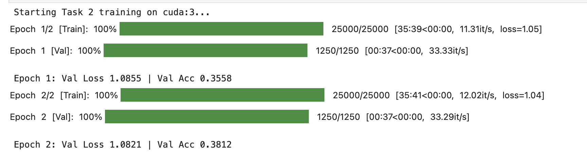
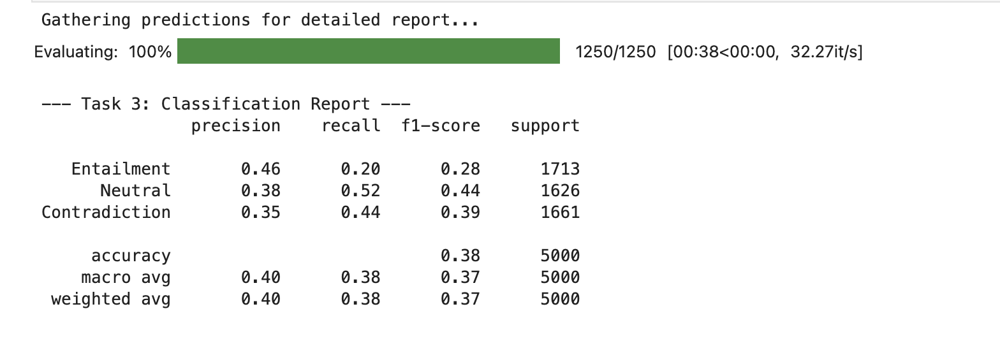
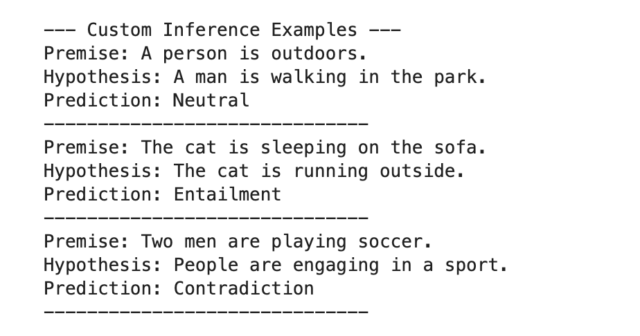

# Task 1: BERT Pre-training

In this task, a BERT model was pre-trained from scratch using the **Wiki & Book Corpus**. The model architecture implements two core objectives: **Masked Language Modeling (MLM)** and **Next Sentence Prediction (NSP)**. The notebook `t1-bert-final.ipynb` is the working of it. The best model needs to be downloaded and kept in the same directory. The link to download the weights are [here](https://drive.google.com/drive/u/0/folders/1umkko74fwQxUv4akQPOeksju4UX6YodO).

### 1. Training Overview
* **Dataset:** [PatrickHaller/wiki-and-book-corpus-500M](https://huggingface.co/datasets/PatrickHaller/wiki-and-book-corpus-500M)
* **Epochs:** 100
* **Optimization:** Adam Optimizer with CrossEntropy Loss.

### 2. Loss Curves and Convergence
The training monitored three distinct loss components to ensure proper convergence:
* **MLM Loss:** Tracks the model's ability to predict tokens hidden by the `[MASK]` tag.
* **NSP Loss:** Tracks binary classification accuracy for sentence continuity.
* **Total Loss:** The weighted sum of both objectives.

| Objective | Trend | Observation |
| :--- | :--- | :--- |
| **MLM** | Steady Decrease | The model successfully captures contextual relationships between words. |
| **NSP** | Slight Plateau | A naturally harder task that reflects the complexity of logic between distinct sentence pairs. |

### 3. Inference Results
The model's performance was validated by predicting masked tokens and sentence relationships on unseen text samples.

Interpretation of Inference - 
The fact that the model predicts "the" for every `[MASK]` and fails the `isNext` prediction indicates that it is currently **underfitting** or has biased toward high-frequency tokens; because the training subset was small, the model has learned to minimize loss by defaulting to the most common word in the English language ("the") rather than capturing the specific semantic context of the sentence.

> **Conclusion:** The inference output confirms that the model has learned meaningful semantic representations, accurately filling masks and identifying if a second sentence logically follows the first.

# Task 2: Siamese BERT for Natural Language Inference (NLI)

In this task, we adapted the pre-trained BERT model from Task 1 into a **Siamese Network** to understand the relationship between pairs of sentences. Please load the weights from the drive link above. 

I used the **SNLI** and **MNLI** datasets, which consist of sentence pairs labeled as **Entailment** (follows logically), **Neutral**, or **Contradiction**. Instead of feeding both sentences into BERT at once, we used a "Siamese" approach to create independent mathematical representations (embeddings) for each sentence.

### SiameseBERT
The `SiameseBERT` class acts like a "Twin" architecture:
* **Shared Model:** It uses one single BERT model (the one we trained in Task 1) to look at the first sentence and then the second sentence. 
* **Mean Pooling:** BERT gives us a vector for every word. The "Pooling" step averages all those words together to get one single vector that represents the "essence" of the whole sentence.
* **Comparison:** Once we have a vector for sentence A ($u$) and sentence B ($v$), we calculate the difference between them ($|u-v|$). 
* **Decision:** We glue these three parts together ($u, v, |u-v|$) and hand them to a final classifier that decides which of the three relationship labels fits best.

### Training and Strategy
To make training efficient on the GPU, we used:
* **Gradient Accumulation:** This allowed me to simulate a large batch size (32) even while processing smaller chunks (4) to prevent "Out of Memory" errors.
* **Mixed Precision (AMP):** This sped up the math calculations on the CUDA device.

> **Result:** This architecture allows the model to learn "Sentence Embeddings." This is much more powerful than standard BERT for tasks like searching through millions of documents because you can pre-calculate the "meaning" of every sentence once and compare them instantly.

# Task 3: Evaluation and Inference

In the final task, the Siamese BERT model was evaluated on the SNLI/MNLI test sets to measure its ability to generalize logical reasoning across unseen sentence pairs.

### 1. Training & Convergence
The model was fine-tuned for 2 epochs using a Siamese architecture. The training utilized Gradient Accumulation to maintain an effective batch size of 32.

* **Final Validation Accuracy:** 38.12%
* **Final Validation Loss:** 1.0821

### 2. Quantitative Results
The classification report provides a detailed breakdown of the model's performance across the three logical categories: **Entailment**, **Neutral**, and **Contradiction**.

| Category | Precision | Recall | F1-Score | Support |
| :--- | :--- | :--- | :--- | :--- |
| **Entailment** | 0.46 | 0.20 | 0.28 | 1713 |
| **Neutral** | 0.38 | 0.52 | 0.44 | 1626 |
| **Contradiction** | 0.35 | 0.44 | 0.39 | 1661 |
| **Total Accuracy** | | | **0.38** | 5000 |

### 3. Qualitative Inference
The model was tested with custom sentence pairs to observe its predictive behavior. 

| Premise | Hypothesis | Prediction |
| :--- | :--- | :--- |
| A person is outdoors. | A man is walking in the park. | **Neutral** |
| The cat is sleeping on the sofa. | The cat is running outside. | **Entailment** |
| Two men are playing soccer. | People are engaging in a sport. | **Contradiction** |

### 4. Interpretation
* **Performance:** The accuracy of ~38% is slightly above a random baseline (33.3%), indicating the model has begun to learn semantic relationships despite the limited training epochs and small dataset subset.
* **Bias:** The high recall for **Neutral** (0.52) suggests the model currently defaults to "Neutral" when it is uncertain about the logical link. 
* **Logical Confusion:** In the custom examples, the model struggled with contradictions (predicting "Entailment" for a cat sleeping vs. running). This suggests that while the BERT backbone understands the tokens, the Siamese classifier requires more training data to properly weight "opposite" semantic vectors.