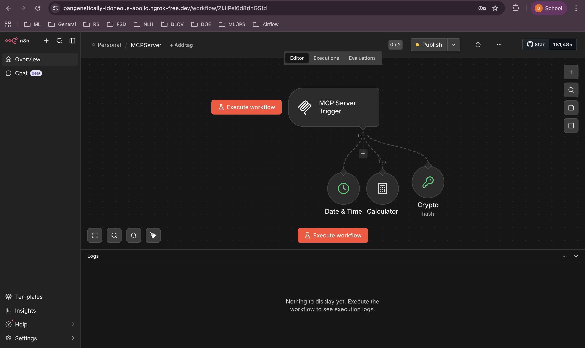
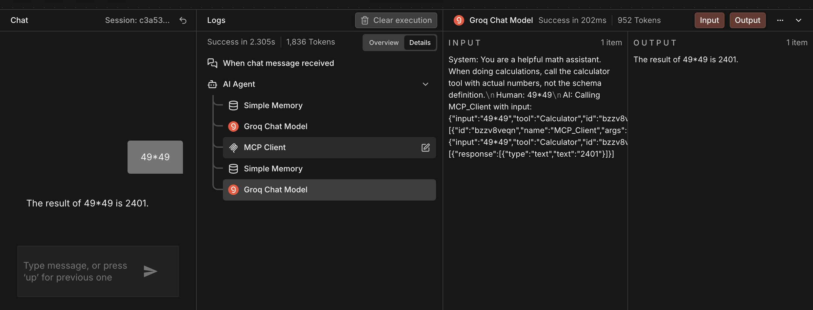
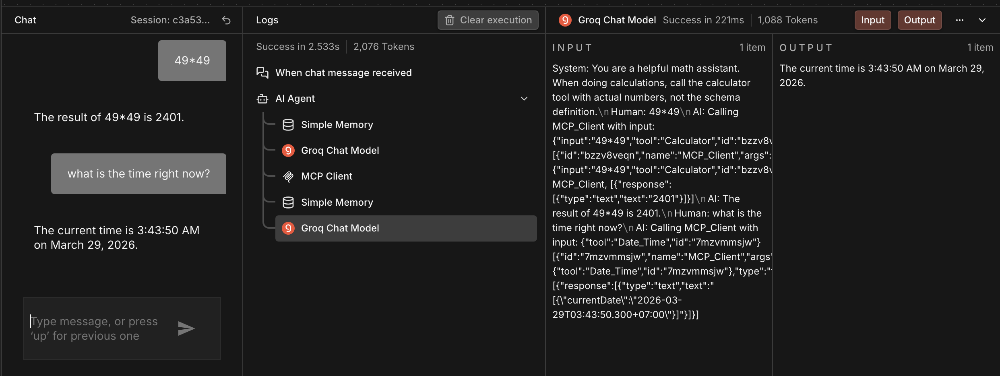
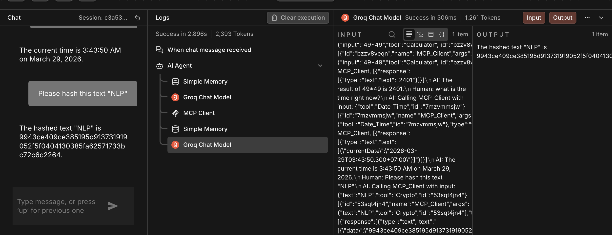
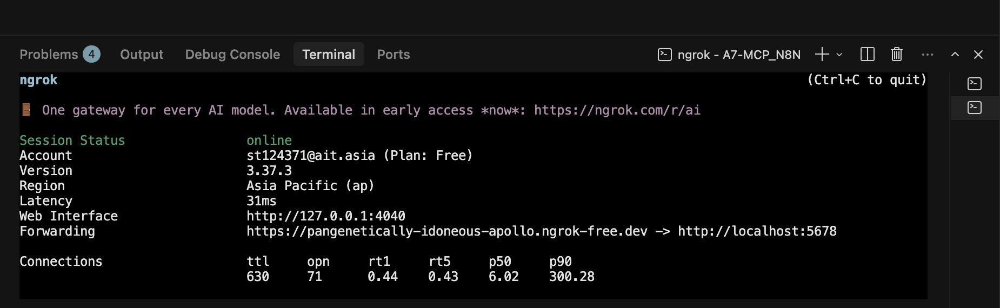
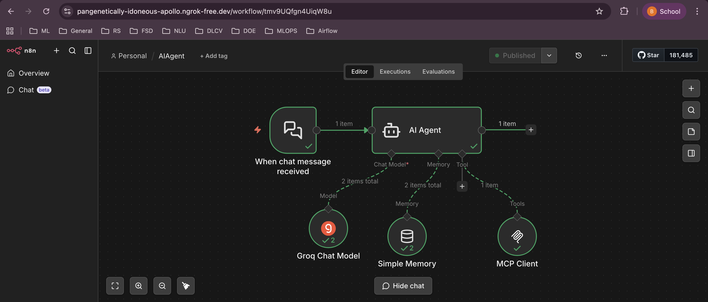
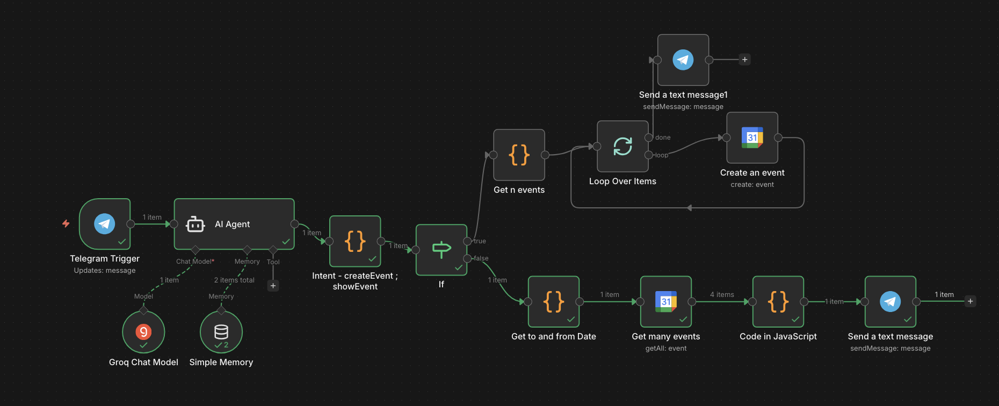
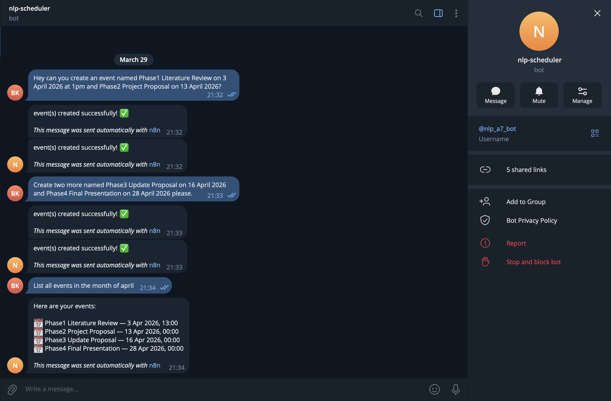
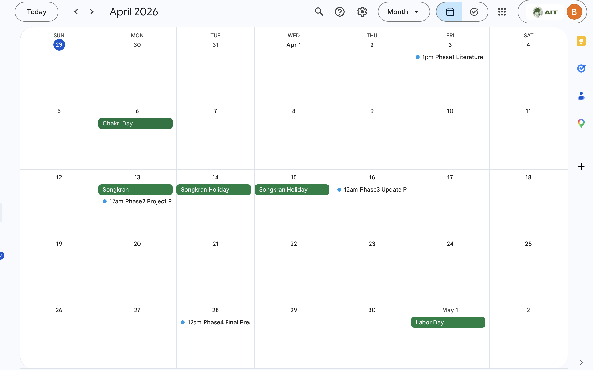

# A7 - MCP with n8n

## Task 1: MCP Infrastructure & Server Setup

## Workflow Files

The workflow files are as follows:

- [Task1-MCP](./T1-AIAgent.json)
- [Task1-AIAgent](./T1-MCPServer.json)
- [Task2-TelegramBotGoogleCalender](./T2.json)

### Overview

Two workflows were created in n8n to implement an MCP (Model Context Protocol) server and an AI agent client that communicates with it over a public internet URL via ngrok.

---

### Workflow 1: MCP Server

The MCP Server workflow exposes three tools via an MCP Server Trigger node. The production URL is tunneled to the internet using ngrok, making it accessible from external clients.



**Tools implemented:**

---

#### Tool 1: Calculator

Uses n8n's built-in Calculator node. Performs arithmetic on two numbers. Invoked when the user asks for a math calculation.



---

#### Tool 2: Date & Time

Uses n8n's built-in Date & Time node. Returns the current date and time. Invoked when the user asks for the current time or date.



---

#### Tool 3: Crypto Hash

Uses n8n's built-in Crypto node. Generates an MD5 hash of a given input text. Invoked when the user asks to hash a string.



---

### ngrok Tunnel

The MCP Server's production URL is exposed publicly via ngrok, allowing the AI Agent workflow to connect to it from anywhere over the internet.



---

### Workflow 2: AI Agent Client

The AI Agent workflow provides a chat interface that connects to the MCP Server using the MCP Client tool node.



**Components:**

- **Chat Trigger:** Receives user messages via the n8n chat interface
- **AI Agent:** Orchestrates tool calling and response generation
- **LLM:** Groq API using model `meta-llama/llama-4-scout-17b-16e-instruct`
- **Window Buffer Memory:** Maintains conversation context across turns (Simple Memory node)
- **MCP Client:** Connects to the MCP Server's production URL via SSE transport and exposes all three tools to the agent

---

### Verification

The AI agent successfully calls MCP tools in response to user prompts:

| User Prompt | Tool Called | Result |
|---|---|---|
| `49*49` | Calculator | `2401` |
| `what is the time right now?` | Date & Time | `3:43:50 AM on March 29, 2026` |
| `Please hash this text "NLP"` | Crypto | `9943ce409ce385195d913731919052f5f0404130...` |

---

### Setup Summary

| Component | Details |
|---|---|
| n8n version | 2.13.4 (Self Hosted, Docker) |
| Tunnel | ngrok v3.37.3 (Free tier, Asia Pacific) |
| MCP Transport | SSE |
| LLM Provider | Groq |
| Model | meta-llama/llama-4-scout-17b-16e-instruct |
| Memory | Window Buffer (Simple Memory) |
| Tools | Calculator, Date & Time, Crypto Hash |


# Task 2 — Telegram & Google Calendar Integration

## Overview

An n8n workflow that connects a Telegram bot to Google Calendar via an AI Agent. Users can create calendar events or list existing ones by sending natural language messages to the bot.

---

## Workflow Diagram


---

## Nodes

### Telegram Trigger
Listens for incoming messages from the Telegram bot. Every message the user sends kicks off the workflow.

### AI Agent
Powered by Groq (llama model) with Simple Memory for conversation history. Reads the user's message and returns a raw JSON object identifying the intent and relevant data.

**Output format — create intent:**
```json
{
  "intent": "create",
  "events": [
    { "summary": "Phase1 Literature Review", "start": "2026-04-03T13:00:00+07:00", "end": "2026-04-03T14:00:00+07:00" }
  ]
}
```

**Output format — verify intent:**
```json
{
  "intent": "verify",
  "dateFrom": "2026-04-01",
  "dateTo": "2026-04-30"
}
```

### Intent node (Code in JavaScript)
Parses the AI Agent's raw text output into a structured JavaScript object and passes it downstream.

### IF node
Routes the flow based on `intent`:
- `true` → intent equals `"create"`
- `false` → intent equals `"verify"`

---

## True Branch — Create Events

**Triggered when:** user asks to create or schedule events.

1. **Get n events (Code node)** — extracts the `events` array from the parsed object and maps each event into a separate item.
2. **Loop Over Items** — iterates one event at a time (batch size 1), repeating until all N events are processed.
3. **Create an event (Google Calendar)** — creates each event using `{{ $json.summary }}`, `{{ $json.start }}`, `{{ $json.end }}` mapped from the current item.
4. **Send a text message (Telegram)** — connected to the `done` output of the loop. Fires once after all events are created and sends a confirmation message back to the user.

**Example interaction:**
> User: "Create Phase1 Literature Review on 3 April 2026 at 1pm and Phase2 Project Proposal on 13 April 2026"
> Bot: "event(s) created successfully! ✅"

---

## False Branch — Verify / List Events

**Triggered when:** user asks to list, check, or verify events within a date range.

1. **Get to and from Date (Code node)** — extracts `dateFrom` and `dateTo` from the parsed object.
2. **Get many events (Google Calendar: Get All)** — fetches all events between the two dates using `{{ $json.dateFrom }}` and `{{ $json.dateTo }}`.
3. **Code in JavaScript** — formats the returned events into a readable list with event name and date/time.
4. **Send a text message (Telegram)** — sends the formatted list back to the user.

**Example interaction:**



As a result, the events have been created in google calendar. 


---

## Key Design Decisions

- **Dynamic event count** — the AI Agent determines how many events to create from the user's message. Nothing is hardcoded. 2 events, 4 events, or 10 — the loop handles all cases.
- **Single workflow, two paths** — both create and verify share the same Telegram trigger and AI Agent, branching only at the IF node.
- **Simple Memory** — gives the agent conversational context so follow-up messages (e.g. "create two more") work correctly.
- **Dates from user input** — all start/end times are inferred by the AI Agent from the user's natural language message, converted to ISO 8601 format with `+07:00` (Asia/Bangkok) offset.

